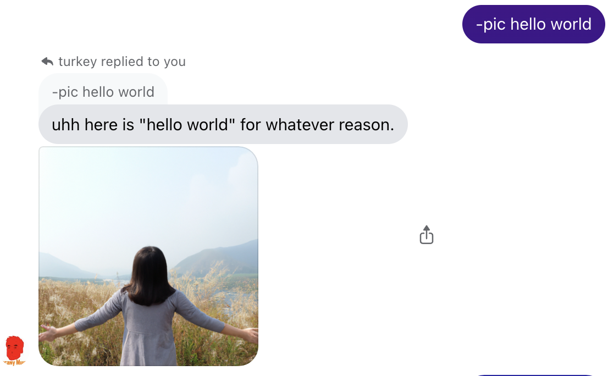
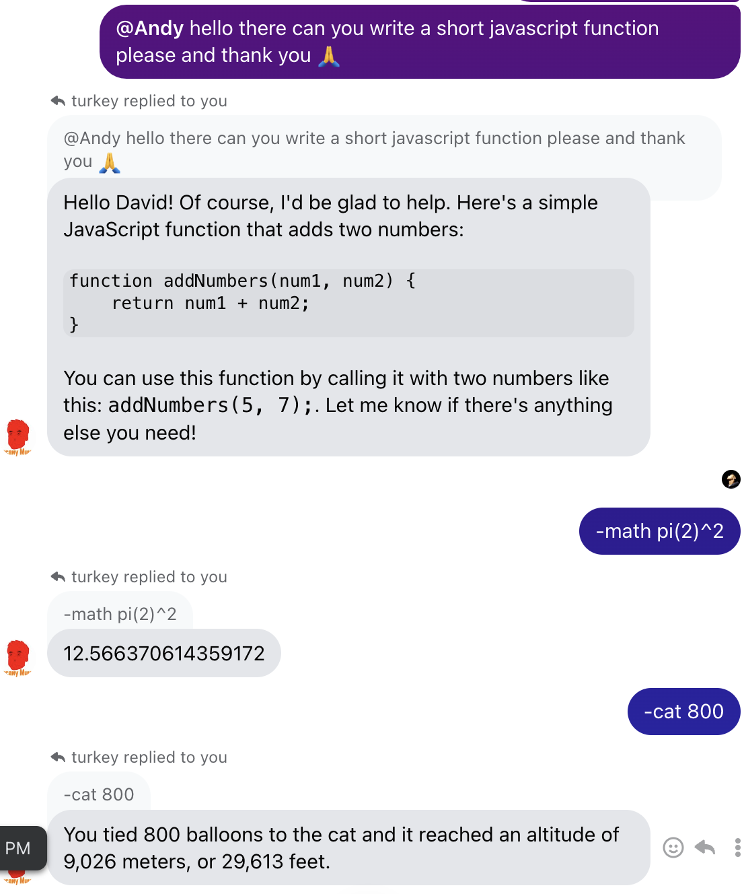

# Facebook Chat Bot
## Overview
This Node.js project uses the [Unofficial Facebook Chat API](https://github.com/Schmavery/facebook-chat-api) and the [OpenAI API](https://platform.openai.com/docs/introduction) to run a ChatGPT style bot from a Facebook account.   

Read the documentation on the Unoffical Facebook Chat API to learn how to customize bot functionality beyond the scope of this project.

## Features
-ChatGPT style bot that can be added to multiple groups with unique tracking

-DALL·E 2 style image generation in Facebook chat

-Simple calculator 

-Cat balloon calculator

## Installation
To get started, clone the repository and install the dependencies.

`git clone https://github.com/castey/facebook-chat-bot.git`

`cd facebook-chat-bot`

`npm install`

### Create a .env file in the root directory.

`FB_EMAIL=[your-facebook-email-address]`

`FB_PASSWORD=[your-facebook-password]`

`OPENAI_API_KEY=[your-openai-api-key]`

`BOT_NAME=[name]` - pick a name

`STAY_ON_FOR=5` - the number of messages a bot will reply to in a single wake cycle

`COOLDOWN=10000`- cooldown time for a bot sending replies during a wake cycle

`HISTORY_LENGTH=10`- number of previous messages that get passed into each AI chat message

## Usage
To start the bot, run:

`node main.js`

# Bot Commands

Here are the available commands for the bot:

| Command                 | Description                                               |
|-------------------------|-----------------------------------------------------------|
| `-pic [prompt]`         | Creates and replies with an AI generated image. You can also use natural language prompts like "send me a picture of a tree" in a wake cycle. |
| `@[name]`               | Tagging the bot account will trigger a wake cycle.        |
| `-math [expression]`    | Calculates the result of the given math expression.       |
| `-cat [number]`         | Calculates how high a cat will go if N number of balloons were tied to it. |

## Dependencies

-dotenv

-openai

-axios

-fs

-facebook-chat-api

-puppeteer

## Screenshots

## Side Notes

Using the image generation feature `-pic` saves the generated image to the AIpics subdirectory. 

You will need to have [Node.js®](https://nodejs.org/en) installed.
 
## License
Idk I'm not a lawyer but like you can use it or whatever. Just give credit because that's nice, please 🥹.

## Contributing
Pull requests are welcome!

